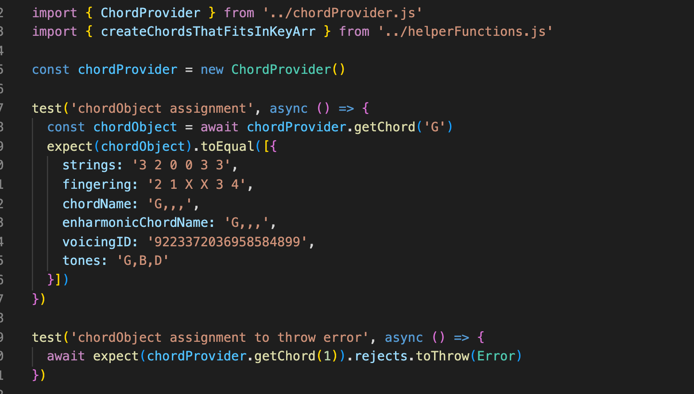
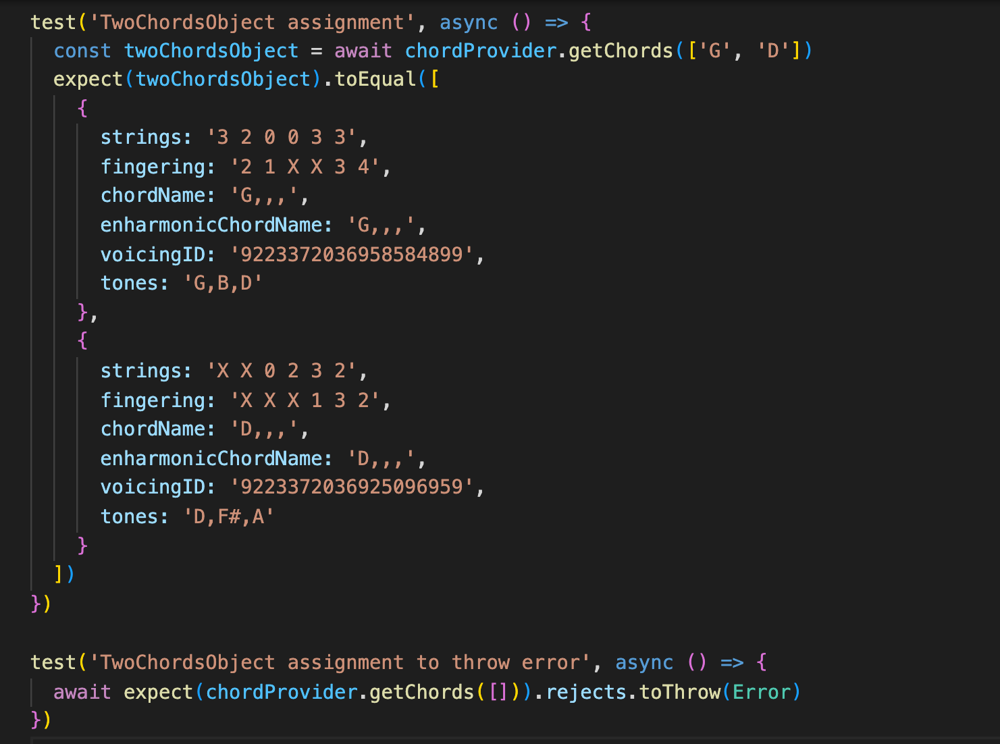
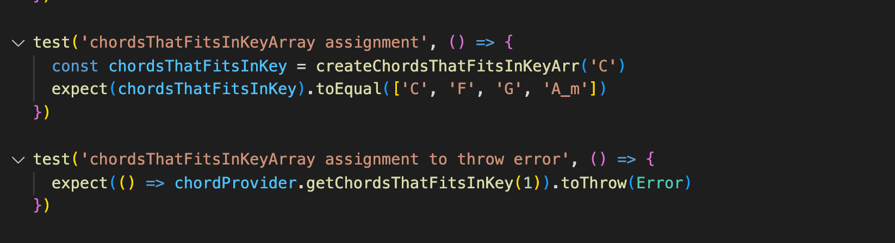

# Testrapport

För att testa min modul använder jag mig av automatiska enhetstester(end-to-end) där mitt fokus legat på att testa modulens huvudmetoder. Alla tester görs utifrån förväntad output vid korrekt argument och kollar om Error kastas vid argument av fel typ. För att skriva de automatiska enhetstesterna har jag använt mig av ramverket Jest.

Alla tester körs med kommandot `npm test` och ger ett testresultat i konsollen. Alternativt `npm run test:coverage` för utförligare information om testerna.

 

 # Överblick chordProvider.test.js

 # getChord

 

# getChords

# getChordAsString

# transposeChords

# getRandomChordStructure

# getChordsThatFitsInKey

